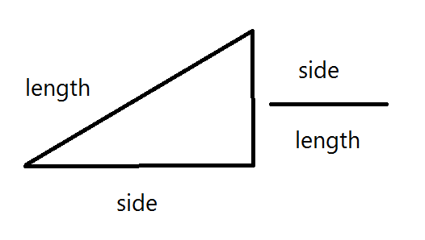
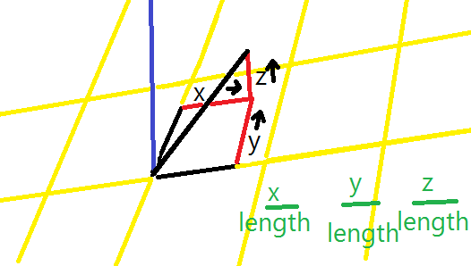

# How It Works

1. We get the relative vector between 2 points, where the first point is the of the line we are growing.
```
[deltaX, deltaY, deltaZ]
```

2. Then we get the ratio of the hypotenuse (the distance between the points) to the sides as a vector. (because the shape won't change -- only the scale.)
```
[deltaX/hypotenuse, deltaY/hypotenuse, deltaZ/hypotenuse]
```



3. Then we multiply by the inverse square of the distance. This makes a vector that is the length of 1/distance_squared in relation to the length of our original relative vector.
```
[1/hypotenuse_squared * deltaX/hypotenuse, 1/hypotenuse_squared * deltaY/hypotenuse, 1/hypotenuse_squared * deltaZ/hypotenuse]
```

4. We do this for all the points that are north poles and again for all the points that are south poles. The we add up the vectors. For north, we want to repel, so we multiply by -1 right before summing to make the vector go in the opposite direction.
```
North results: [summedX, summedY, summedZ]
South results: [summedX, summedY, summedZ]
```

5. Then we add those together for a final summed vector. This vector is pointing in the direction we want our line to grow, but it can vary in size, so we get the ratio of its distance to sides like we did with the first 2 points in step **(2.)** Now we have the ratio vector of the direction we want to move in. We can always move the same amount for each iteration as the line grows by multiplying by 10 or 0.1 or whatever we choose for the scale of the grid.