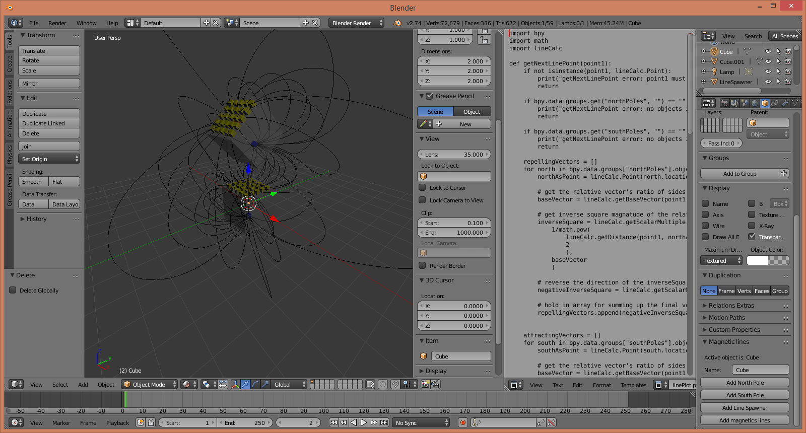

# 3D Magnetic Lines with blender

Does this:

<video controls width="100%">
<source src="./animation.avi" type="video/avi"> 
</video>

[On Youtube](https://youtu.be/B3bTxSRhlVY)

## How to use
Run the AddUIPanel.py script in the text editor of the example `.blend` file -- then use the panel added to the object properties. (the cube icon amongst the buttons screen division as shown in the screenshot below) To use with a new blender project, open all the `.py` files in the text editor, then run AddUIPanel.py to add the panel to the object properties.

[How It Works](./howItWorks.md)